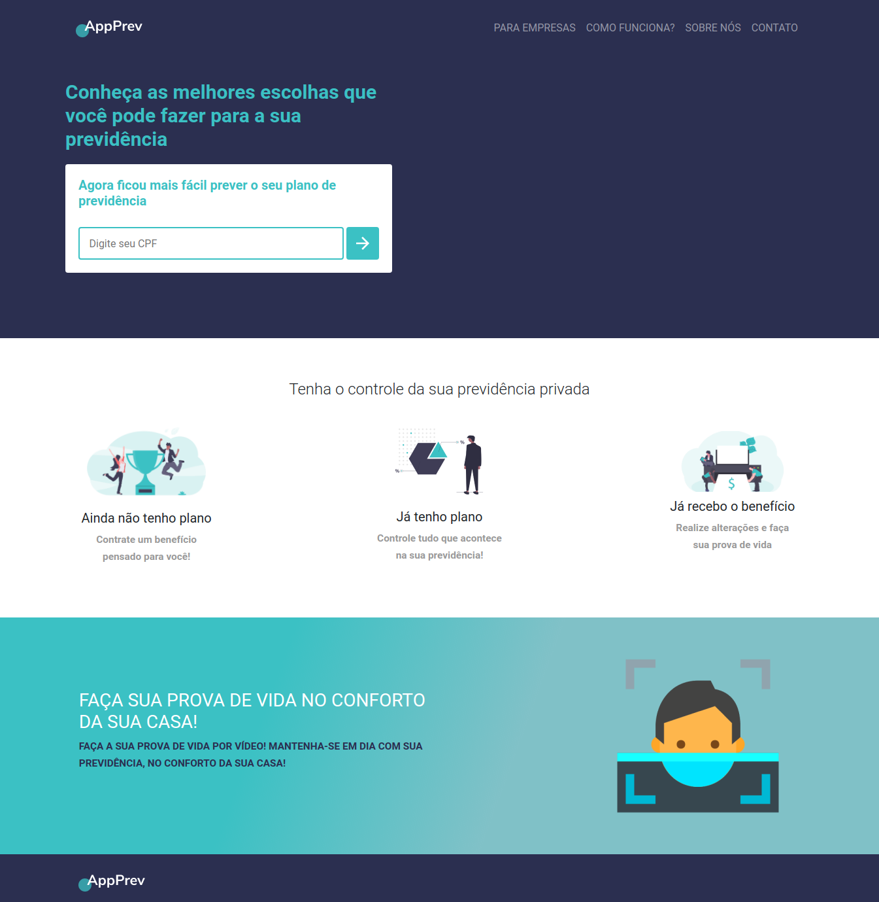

<h1 align="center">
  
</h1>

# AppPrev
Contratação de planos de previdência privada de maneira consistente

  

  
	
  

  

  
  

<h2 align='center'>
      
</h2>  

Atualmente a previdência privada vem tomando força no Brasil, porém muitas dúvidas e inquietações surgem sobre o tema, quais decisões cada pessoa deve tomar?

A AppPrev analisa os dados de cada usuário e retorna a melhor opção para  você realizar a sua previdência privada.

Nossa meta é estar durante toda a jornada dos participantes das Entidades com:
  <ul>
    <li>Jornada de adesão;</li>
<li>Jornada de alteração de Perfil, alteração de % de contribuição;</li>
<li>Jornada de desligamento do colaborador (Institutos);</li>
<li>Jornada Pré Aposentadoria (5 anos antes da idade prevista);</li>
<li>Jornada da escolha do benefício;</li>
<li>Jornada Pós Aposentadoria (alteração de opção de renda para cotas ou percentual de saldo);</li>
<li>Prova de Vida.</li>
  </ul>

  
## Wireframe
Check out the project [wireframe](https://www.figma.com/file/KQuubPaYC7DCB8v1g8IZFE/HackaPrev?node-id=1%3A2).
  
## Show your support

Give a ⭐️ if this project helped you!

## :memo: License

This project is under the MIT license. See the [LICENSE](LICENSE.md) for details.

---

Made with ♥ by Welton Felix :wave: [Get in touch!](mailto:contato.weltonf@gmail.com)
